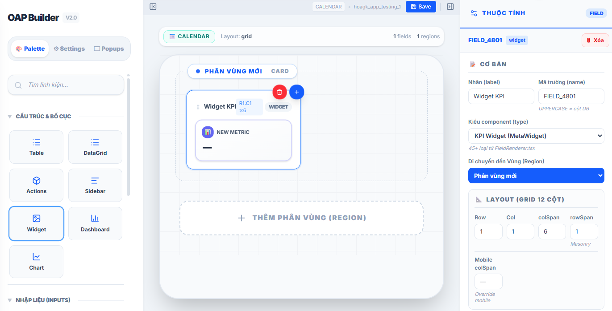

# oap@ovi/toy

OAP là platform cho phép bạn tạo trang web riêng tùy ý từ các component có sẵn do công ty cung cấp.

Mỗi component cho phép tùy chỉnh giao diện và lệnh SQL riêng bằng việc config các file JSON (tham khảo file [ví dụ](example.json)). Có thể dễ dàng tạo config bằng giao diện trực quan với extension Layout Builder của công ty.

    

Repo này chứa 1 vài sản phẩm toy để tác giả làm quen.